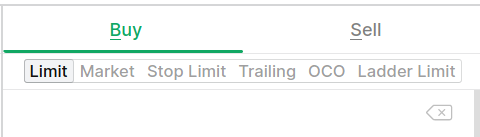
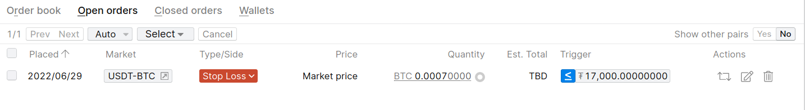

Why
===

Bittrex web GUI offers only limited subset of order types that can be placed.

The ones available are: Limit, Market, Stop Limit, Trailing, OCO, and Ladder Limit.
One particular order type that is missing on this list is a Stop Market order.

While web GUI does not allow to place such order type Bittrex REST API allows placing it.

This script enables you to place Stop Loss Market orders on Bittrex exchange.

Usage
=====

To use this script you need to first:

1. download ``market-sl.py`` script and ``requirements.txt`` to your computer.
2. install required dependencies by issuing: ``pip install -r requirements.txt``

To see what parameters ``market-sl.py`` accepts simply issue:

``./market-sl.py -h``

or 

``python market-sl.py -h``

Example invocation may look like this:

``./market-sl.py BTC-USDT 0.0007 17000 f35b767ea01f59bd95d5098d742854cf f0f459a82474e8a74e93152ca5b03683``

Here, we place an order to market sell ``0.0007`` BTC to USDT when BTC-USDT price falls below 17000. The last two arguments are API Key and Secret with `Trade` permissions.

Once placed, Market Stop Loss order will be visible in your open orders list.

Tip/Donate
==========

If you like this script and find it useful do not hesitate to tip/donate:

Litecoin (LTC): ``ltc1qvamejqpzphzxxnssc9uvqhk3zs0tujyrzs52eu``

Tezos (XTZ): ``tz1KpJWhAnctbAUJQxHNsK24YBKHowG8Pm85``

Dash (DASH): ``Xk3QLzD7PSbwf3Wze75HUxqrgC72fktWMP``

Ada (ADA): ``addr1v9z3qf8spp36lpkf9s0na95st40dtgwdqk903rj60ph9lgq2h8v4d``

